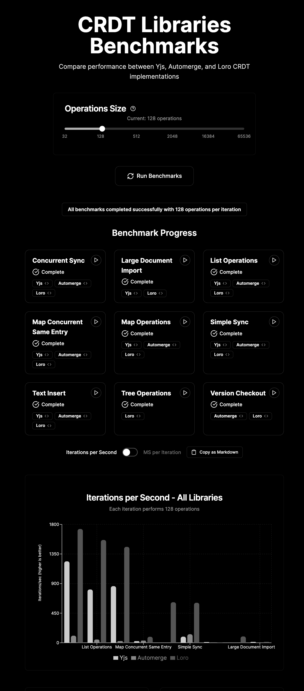

# CRDT Library Benchmarks

An interactive browser-based benchmarking tool to compare the performance of
popular CRDT (Conflict-free Replicated Data Type) libraries:

- [Yjs](https://github.com/yjs/yjs)
- [Automerge](https://github.com/automerge/automerge)
- [Loro](https://github.com/loro-dev/loro)



## Try It On Your Browser

Visit [crdt-benchmarks.example.com](https://crdt-benchmarks.example.com) to run
the benchmarks directly in your browser.

## Features

- Run comprehensive benchmarks comparing CRDT library performance
- Interactive UI with real-time results visualization
- Customizable operation size to test different workloads
- View and compare code implementations for each operation
- Copy results in Markdown format for easy sharing
- Run specific benchmark operations individually

## Available Benchmarks

- Text operations (insert)
- List operations
- Map operations
- Concurrent map edits
- Tree operations (Loro specific)
- Simple sync
- Concurrent sync
- Version checkout
- Large document import

## Getting Started

### Prerequisites

- [Node.js](https://nodejs.org/) (v18 or newer)
- [pnpm](https://pnpm.io/) (recommended)

### Installation

```bash
# Clone the repository
git clone https://github.com/yourusername/crdt-lib-bench.git
cd crdt-lib-bench

# Install dependencies
pnpm install

# Start the development server
pnpm dev
```

The application will be available at http://localhost:5173.

## Usage

1. Open the application in your browser
2. Adjust the operation size slider to set the workload (default: 128
   operations)
3. Click "Run Benchmarks" to execute all benchmarks
4. View the results in the charts that appear below
5. Click on individual benchmarks to run specific operations
6. Toggle between "Iterations per Second" and "MS per Iteration" to view
   different metrics
7. Click "Copy as Markdown" to copy results in a shareable format

## Contributing

Contributions are welcome! Here's how you can add a new benchmark:

### Adding a New Benchmark

1. Open `src/benchmarks/crdtBenchmarks.ts`
2. Add a new entry to the `CODE_SNIPPETS` object with the following format:

```typescript
"[Library] - [Operation Name]": {
  code: `
    // Code snippet that will be displayed in the UI
    // Replace constants like OP_SIZE with their respective values
  `,
  fn: () => {
    // Actual implementation function that will be executed
    // for the benchmark
  }
}
```

3. Ensure you add implementations for all supported libraries (Yjs, Automerge,
   Loro) when applicable
4. The benchmark will automatically appear in the UI after a restart
